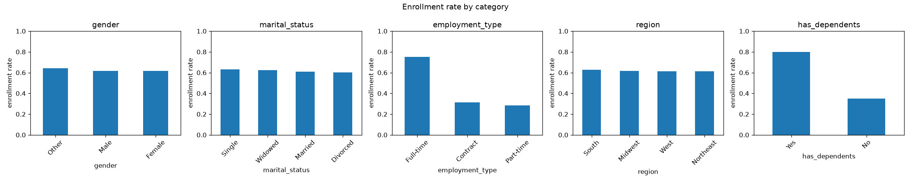
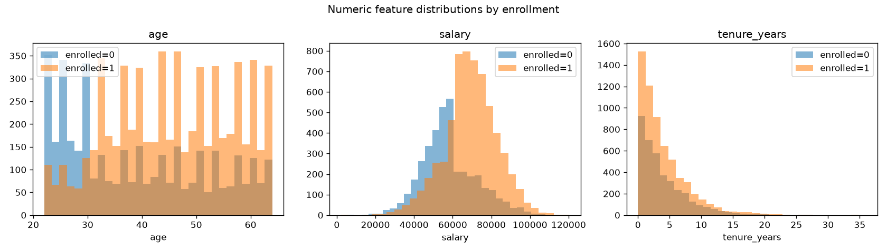
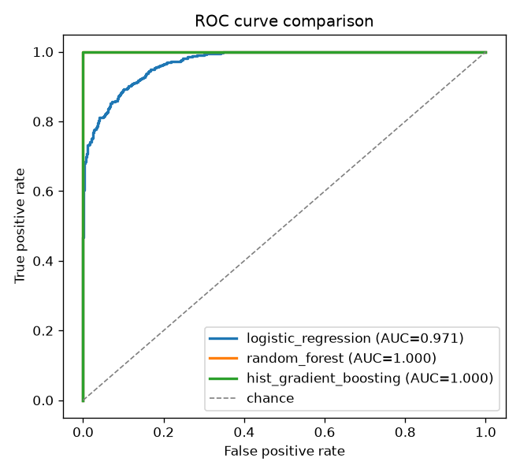
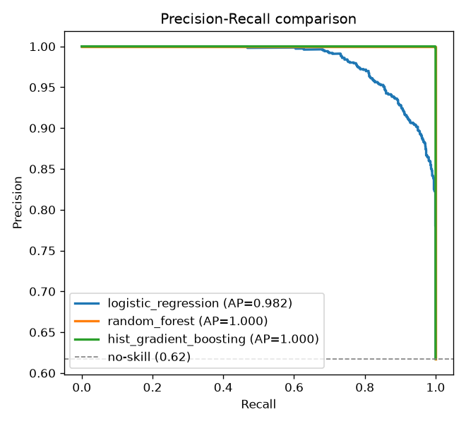
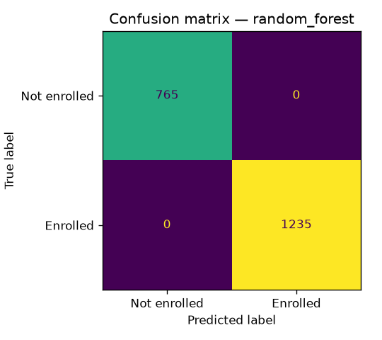
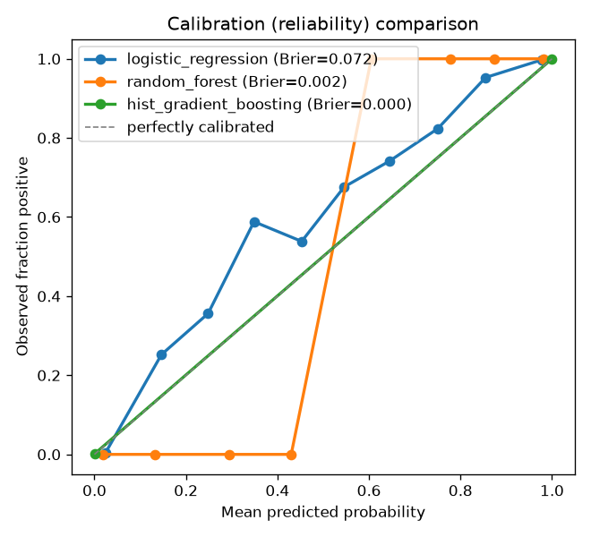
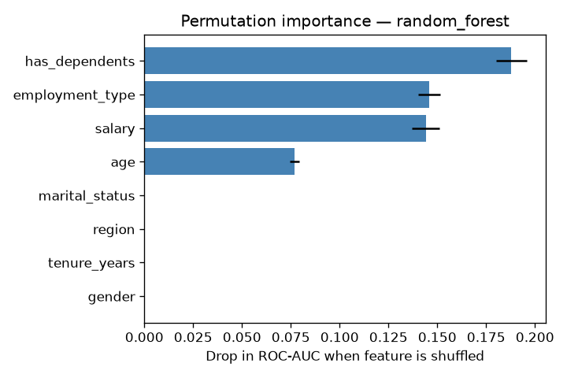

# Report — Predicting Insurance Enrollment

## 1. Objective

Predict whether an employee opts in (`enrolled = 1`) to a voluntary insurance
product from demographic and employment attributes. This is a **binary
classification** problem, evaluated end-to-end: data processing → modelling →
evaluation → serving.

---

## 2. Data observations

The dataset (`data/employee_data.csv`) has **10,000 rows × 10 columns**.
Reproduce these with `python -m src.eda`.

### Quality
- **No missing values**, **no duplicate `employee_id`s**, and **no conflicting
  duplicate feature rows** in the supplied CSV. The pipeline still ships with
  median/most-frequent **imputation** anyway — the brief says the data mimics
  real group-benefits enrollment, where missing salary/tenure/marital status are
  the norm, and without imputers a single NaN would silently become a NaN
  prediction. Robustness to the *stated domain*, not just the sample file.
- `employee_id` is a pure identifier and is **dropped** before modelling; keeping
  it would invite memorisation of individual rows.

### Target balance
- `enrolled = 1`: **61.7%**, `enrolled = 0`: **38.3%**. Mildly imbalanced —
  enough to prefer ROC-AUC / F1 over raw accuracy and to use
  `class_weight="balanced"` in the linear/forest models.

### Numeric features
| Feature | Mean | Std | Min | Median | Max |
|---------|-----:|----:|----:|-------:|----:|
| `age` | 43.0 | 12.3 | 22 | 43 | 64 |
| `salary` | 65,033 | 14,924 | 2,208 | 65,056 | 120,312 |
| `tenure_years` | 3.97 | 3.90 | 0 | 2.8 | 36 |

### Which features actually carry signal
Enrollment rate broken down by category is the most revealing view:

| Feature | Strongest → weakest group (enrollment rate) | Signal |
|---------|----------------------------------------------|--------|
| **`has_dependents`** | Yes **0.80** vs No **0.35** | **Strong** |
| **`employment_type`** | Full-time **0.75** vs Contract 0.31 vs Part-time 0.28 | **Strong** |
| `salary` | higher salary → higher enrollment (continuous) | Moderate |
| `age` | mild effect | Weak |
| `gender` | Other 0.64 / Male 0.62 / Female 0.62 | ~None |
| `marital_status` | 0.60–0.63 across all | ~None |
| `region` | 0.61–0.63 across all | ~None |

**Takeaway:** enrollment is driven mostly by `has_dependents`, `employment_type`,
and `salary`. `gender`, `marital_status`, and `region` are essentially noise —
their per-group rates barely move from the 61.7% base rate. (Section 5 confirms
this quantitatively with permutation importance.)





---

## 3. Data processing pipeline

Implemented in `src/data.py` and `src/preprocess.py`:

1. **Load & validate** — assert the schema, a non-null binary target, and fail
   loudly otherwise (so a bad file never silently corrupts training).
2. **Stratified 80/20 split** — preserves the 61.7% positive rate in both train
   and test, keeping the held-out evaluation representative.
3. **Preprocessing as a `ColumnTransformer`**, wrapped *inside* each model
   `Pipeline`:
   - numeric (`age`, `salary`, `tenure_years`) → median impute → `StandardScaler`
   - categorical (`gender`, `marital_status`, `employment_type`, `region`,
     `has_dependents`) → most-frequent impute →
     `OneHotEncoder(handle_unknown="ignore")`

**Why preprocessing lives inside the pipeline:** the scaler and encoder are fit
only on the training folds during cross-validation — never on the test set — so
there is **no data leakage**. The same fitted transform is serialised with the
model, so the API receives raw JSON and applies the identical transformation at
inference time.

---

## 4. Model choices & rationale

Three models were trained, each tuned with **5-fold cross-validated grid search**
optimising ROC-AUC (`src/train.py`):

| Model | Why it was chosen |
|-------|-------------------|
| **Logistic Regression** | Fast, interpretable linear baseline. If a linear model does well, the signal is largely additive. |
| **Random Forest** | Captures non-linearities and feature interactions with little tuning; robust to mixed feature types. |
| **HistGradientBoosting** | scikit-learn's boosted trees — usually the strongest tabular model, and built in (no extra dependency such as XGBoost). |

Selection rule: **best cross-validated ROC-AUC wins** (computed on the training
folds only) and is saved to `models/model.joblib`. The held-out test set is used
**only** to report the winner's performance afterwards — never to choose it — so
the reported test metrics stay an unbiased estimate rather than a number the
selection was tuned against.

All models optimise ROC-AUC in cross-validation (robust to the class imbalance),
and the linear/forest models use `class_weight="balanced"` so the 62/38 split
doesn't bias them toward the majority class.

---

## 5. Evaluation results

From `artifacts/metrics.json`. **CV ROC-AUC** (5-fold, training data) is the
selection criterion; the remaining columns are the held-out test set (2,000
rows), reported only *after* selection. The **Dummy** row (predict the majority
class for everyone) is the no-skill floor every real model must beat:

| Model | CV ROC-AUC | Test Acc | Test F1 | Test ROC-AUC | Test PR-AUC | Brier ↓ |
|-------|:----------:|:--------:|:-------:|:------------:|:-----------:|:-------:|
| Dummy (most-frequent) | 0.5000 | 0.6175 | 0.764 | 0.5000 | 0.618 | 0.383 |
| Logistic Regression | 0.9663 | 0.894 | 0.912 | 0.971 | 0.982 | 0.072 |
| **Random Forest (selected)** | **1.0000** | **1.000** | **1.000** | **1.000** | **1.000** | **0.002** |
| HistGradientBoosting | 0.99999769 | 0.9995 | 1.000 | 1.000 | 1.000 | **0.0005** |

Reading the table:
- **Every model beats the 0.6175 majority-class floor** — Logistic Regression by
  +28 points of accuracy, the trees essentially perfectly. Without the Dummy row
  a reader can't tell whether "89% accuracy" is impressive or trivial; here it's
  clearly real signal.
- **PR-AUC** (imbalance-aware) tells the same story as ROC-AUC, so the ROC numbers
  aren't an artefact of the 62/38 split.
- **Brier score** (lower = better-calibrated probabilities) is where the tie gets
  interesting: Random Forest wins selection on CV ROC-AUC by a ~2e-6 margin, but
  **HistGradientBoosting is actually the best-calibrated model** (Brier 0.0005 vs
  0.0021). For a product that consumes a *likelihood*, that's exactly the kind of
  secondary criterion I'd use to break a statistical tie — see below.





The ROC/PR comparisons are more telling than any single curve: the tree ensembles
sit in the top-left/top-right corners (near-perfect), while Logistic Regression
traces a strong but visibly imperfect ~0.97 curve.

### Calibration — do the probabilities mean what they say?
The business wants a *likelihood* of enrollment, so probability quality matters as
much as ranking. The reliability curves and Brier scores:



On this **separable synthetic** data every model looks well-calibrated (the trees
are almost always right *and* confident, so their 0/1 outputs land on the
diagonal). **This is a data artefact, and I would not expect it to hold on real,
noisy enrollment data**, where Random Forest's near-0/1 probabilities are
notoriously over-confident. On a real deployment I'd (a) prefer the lower-Brier
gradient-boosting model or (b) wrap the classifier in `CalibratedClassifierCV`
(isotonic/Platt) and monitor the Brier score over time. Reporting Brier now,
rather than only accuracy, is what surfaces this.

### Why the tree models score ~perfectly (and why that's not leakage)
This is the most important finding. I investigated the perfect scores rather than
accepting them:

- A plain **depth-6 decision tree perfectly classifies all 10,000 rows** (100%
  train accuracy), and even a depth-3 tree already reaches 91%. A model this
  shallow separating the data perfectly means the target is a
  (near-)**deterministic function** of a handful of feature thresholds.
- The splits the tree finds are thresholds on `salary`, and flags on
  `employment_type = Full-time` and `has_dependents`, plus a little `age` — the
  same features the EDA and permutation importance flag as the only ones that
  matter.

So the synthetic data was generated by an essentially rule-based process, and
tree ensembles recover that rule exactly. My pipeline provably has **no
leakage** (`employee_id` and the target are dropped; preprocessing is fit only
on training folds). The perfect score is a property of the **synthetic
generator**, not a modelling artefact.

**Logistic Regression "only" reaches 0.97 AUC** precisely because the decision
boundary is a set of axis-aligned thresholds and interactions that a single
linear boundary cannot represent — a textbook illustration of linear vs.
tree-based model capacity.

### Feature importance (which attributes actually matter)
Permutation importance on the held-out test set (shuffle one feature, measure
the drop in ROC-AUC) makes the model's reasoning explicit and confirms the EDA:



| Feature | Importance (mean ROC-AUC drop) |
|---------|:------------------------------:|
| `has_dependents` | 0.188 |
| `employment_type` | 0.146 |
| `salary` | 0.144 |
| `age` | 0.077 |
| `marital_status` | ~0 |
| `region` | ~0 |
| `gender` | 0.000 |
| `tenure_years` | 0.000 |

Only **four** features carry any signal, and `gender`, `marital_status`,
`region`, and `tenure_years` are effectively **zero** — the model ignores them
entirely. This is a clean, quantified confirmation of the EDA and means the same
performance is achievable with a much smaller, cheaper-to-serve feature set.

---

## 6. Key takeaways

- Enrollment is predictable primarily from `has_dependents`, `employment_type`,
  and `salary`; three of the eight features are noise.
- On this synthetic data, tree ensembles are effectively perfect and Logistic
  Regression is a strong, interpretable ~0.97-AUC baseline.
- **Perfect metrics are a signal to investigate, not to celebrate.** I verified
  the cause (a deterministic synthetic target) instead of assuming leakage or
  declaring success. On real enrollment data I would expect materially lower,
  noisier numbers.

---

## 7. What I'd do next with more time

1. **Deeper interpretability** — permutation importance is already included
   (Section 5); next I'd add SHAP values for per-prediction, direction-of-effect
   explanations that stakeholders can act on.
2. **Active calibration** — Brier scores and reliability curves are already
   reported (Section 5); the next step is wrapping the classifier in
   `CalibratedClassifierCV` and validating on real (noisy) data where the trees'
   near-0/1 probabilities would need correcting.
3. **Threshold selection** — tune the decision threshold to the business cost of
   false positives vs. false negatives rather than defaulting to 0.5.
4. **Stress-test the imputation** — median/most-frequent imputers are in place;
   with real data I'd validate them against typos in categoricals, outliers, and
   missing-not-at-random patterns.
5. **Drop the four zero-importance features** (`gender`, `marital_status`,
   `region`, `tenure_years`) and confirm no performance loss — a simpler model is
   cheaper to serve and easier to explain.
6. **Stronger validation on real data** — nested CV and a temporal/holdout split
   to get an honest generalisation estimate once scores aren't saturated.
7. **Productionisation** — the API is already containerised (multi-stage,
   non-root Docker) with CI; next I'd add request logging, drift monitoring, a
   retraining trigger, and wire the MLflow model registry into deployment.

---

## Appendix — reproduce everything

Every stochastic step uses a fixed seed (`config.RANDOM_STATE = 42`) **and**
dependencies are pinned to exact versions in `requirements.txt`, so the numbers
above and the committed figures reproduce bit-for-bit — reproducibility is seed
*plus* a locked environment, not just the seed.

```bash
pip install -r requirements-dev.txt   # runtime + test/lint tooling
python -m src.eda        # EDA stats + figures
python -m src.train      # train, tune, track (MLflow), select & save best
python -m pytest -q      # tests
ruff check src/ tests/   # lint
uvicorn src.api:app      # serve predictions at /docs
```
